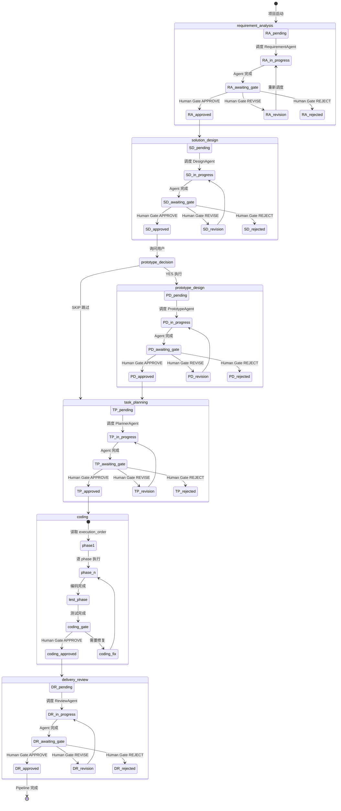

# Multi-Agent Delivery Pipeline

AI 驱动的全栈开发多 Agent 工作流，基于 Claude Code 的 sub-agent 机制实现。Orchestrator 负责状态管理和人工确认门禁，8 个专业 Agent 各司其职，完成从需求分析到交付审查的端到端流程。

## 架构总览

```
┌─────────────────────────────────────────────────────────────────────┐
│                         USER (Human Gate)                           │
│                    APPROVE / REVISE / REJECT                        │
└──────────────────────────────┬──────────────────────────────────────┘
                               │
┌──────────────────────────────▼──────────────────────────────────────┐
│                       ORCHESTRATOR                                   │
│                (workflow-orchestrator skill)                         │
│                                                                      │
│  只做三件事:                                                         │
│  1. 管理状态 (.ai-dev/state.json, decision-log, issue-log)          │
│  2. 调度子 Agent (Agent tool + subagent_type)                       │
│  3. Human Gate (展示结果、收集用户决策)                               │
│                                                                      │
│  不做: 需求分析、方案设计、原型、编码、测试                              │
└──────────────────────────────┬──────────────────────────────────────┘
                               │
          ┌────────────────────┼────────────────────┐
          │                    │                    │
          ▼                    ▼                    ▼
┌─────────────────┐  ┌─────────────────┐  ┌─────────────────┐
│ RequirementAgent │  │   DesignAgent   │  │ PrototypeAgent  │
│ (Stage 1)        │  │   (Stage 2)     │  │ (Stage 3, 可选)  │
│                  │  │                 │  │                 │
│ 产出:            │  │ 产出:           │  │ 产出:           │
│ 01_requirement   │  │ 02_solution     │  │ 03_prototype    │
│ .json            │  │ .json           │  │ .html           │
└─────────────────┘  └─────────────────┘  └─────────────────┘
          │                    │                    │
          └────────────────────┼────────────────────┘
                               │
                               ▼
                    ┌─────────────────┐
                    │  PlannerAgent   │
                    │  (Stage 4)      │
                    │                 │
                    │  产出:          │
                    │  04_plan.json   │
                    │  (含接口契约)    │
                    └────────┬────────┘
                             │
              ┌──────────────┼──────────────┐
              │              │              │
              ▼              ▼              ▼
     ┌────────────┐ ┌────────────┐ ┌────────────┐
     │BackendAgent│ │FrontendAgent│ │ TestAgent  │
     │ (Stage 5)  │ │ (Stage 5)  │ │ (Stage 5)  │
     │            │ │            │ │            │
     │ workspace/ │ │ workspace/ │ │ workspace/ │
     │ backend/   │ │ frontend/  │ │ tests/     │
     │            │ │            │ │            │
     │ 05_report  │ │ 06_report  │ │ 07_report  │
     └────────────┘ └────────────┘ └────────────┘
              │              │              │
              └──────────────┼──────────────┘
                             │
                             ▼
                    ┌─────────────────┐
                    │  ReviewAgent    │
                    │  (Stage 6)      │
                    │                 │
                    │  产出:          │
                    │  08_final_report│
                    │  .md            │
                    └─────────────────┘
```

## Pipeline 流程图 (Mermaid)



## 目录结构

```
项目根目录/
├── .claude/
│   ├── settings.json                 # 全局权限配置
│   ├── settings.local.json           # 本地覆盖 (空)
│   ├── agents/                       # Agent 身份定义
│   │   ├── requirement-agent.md
│   │   ├── design-agent.md
│   │   ├── prototype-agent.md
│   │   ├── planner-agent.md
│   │   ├── backend-agent.md
│   │   ├── frontend-agent.md
│   │   ├── test-agent.md
│   │   └── review-agent.md
│   └── skills/                       # 方法论定义
│       ├── workflow-orchestrator/    # 编排中枢 (主 skill)
│       │   ├── SKILL.md
│       │   └── references/
│       │       ├── state-machine.md
│       │       ├── agent-dispatch.md
│       │       ├── human-gate-protocol.md
│       │       ├── coding-phase-protocol.md
│       │       ├── issue-log-protocol.md
│       │       └── memory-protocol.md
│       ├── requirement-analysis/
│       │   ├── SKILL.md
│       │   └── references/
│       │       ├── analysis-rules.md
│       │       ├── input-fetching.md
│       │       └── output-contracts.md
│       ├── solution-design/
│       │   ├── SKILL.md
│       │   └── references/
│       │       ├── phase-details.md
│       │       ├── mcp-baseline-rules.md
│       │       └── output-contracts.md
│       ├── prototype-design/
│       │   ├── SKILL.md
│       │   └── references/
│       │       └── output-contracts.md
│       ├── task-planning/
│       │   ├── SKILL.md
│       │   └── references/
│       │       ├── decomposition-rules.md
│       │       └── output-contracts.md
│       ├── backend-coding/
│       │   ├── SKILL.md
│       │   └── references/
│       │       ├── scaffold.md
│       │       └── output-contracts.md
│       ├── frontend-coding/
│       │   ├── SKILL.md
│       │   └── references/
│       │       └── output-contracts.md
│       ├── testing/
│       │   ├── SKILL.md
│       │   └── references/
│       │       └── output-contracts.md
│       └── delivery-review/
│           ├── SKILL.md
│           └── references/
│               └── output-contracts.md
├── .ai-dev/                          # 运行时状态 (自动创建)
│   ├── state.json                    # Pipeline 状态
│   ├── decision-log.json             # 人工决策记录
│   ├── issue-log.json                # 跨阶段问题
│   ├── task-board.json               # 编码阶段任务追踪
│   ├── scaffold-defaults.yaml        # 脚手架配置
│   └── memory/
│       └── project.md                # 项目经验积累
├── artifacts/                        # 阶段产物
│   ├── 01_requirement.json
│   ├── 02_solution.json
│   ├── 03_prototype.html
│   ├── 04_plan.json
│   ├── 05_backend_report.md
│   ├── 06_frontend_report.md
│   ├── 07_test_report.md
│   └── 08_final_report.md
└── workspace/                        # 代码输出
    ├── backend/
    ├── frontend/
    └── tests/
```

## 6 阶段 Pipeline

| Stage | Agent | Skill | 产出 | 必须 |
|-------|-------|-------|------|------|
| 1. 需求分析 | RequirementAgent | requirement-analysis | artifacts/01_requirement.json | 是 |
| 2. 方案设计 | DesignAgent | solution-design | artifacts/02_solution.json | 是 |
| 3. 原型设计 | PrototypeAgent | prototype-design | artifacts/03_prototype.html | 否 |
| 4. 任务规划 | PlannerAgent | task-planning | artifacts/04_plan.json | 是 |
| 5. 编码实现 | BackendAgent + FrontendAgent + TestAgent | backend/frontend-coding + testing | workspace/* + reports | 是 |
| 6. 交付审查 | ReviewAgent | delivery-review | artifacts/08_final_report.md | 是 |

## 核心设计原则

### Orchestrator 不干活的铁律

Orchestrator 只做三件事，**严禁**自己执行任何阶段工作：

1. 管理状态文件（`.ai-dev/` 读写）
2. 调度子 Agent（`Agent(subagent_type, prompt)`）
3. Human Gate（展示结果、收集用户决策）

用户提供的需求描述、URL、文档路径——全部**原样传递**给子 Agent，不做任何预处理。

### Human Gate 门禁

每个阶段完成后必须经过人工确认，三种决策：

- **APPROVE** — 通过，进入下一阶段
- **REVISE** — 修改，带上反馈重新调度当前阶段 Agent
- **REJECT** — 拒绝，选择回退到某个阶段或终止 pipeline

Draft 产物（有未解决问题）会通过 AskUserQuestion 工具逐批收集答案后重新调度。

### 接口契约 = 法律

`04_plan.json` 中的 `interface_contracts` 是前后端协作的唯一标准。BackendAgent 必须按契约实现 API，FrontendAgent 必须按契约消费。任何一方发现契约不合理，只能通过 issue 上报，不能自行修改。

### 文件所有权隔离

| Agent | 写权限 | 只读 |
|-------|--------|------|
| RequirementAgent | artifacts/01_requirement.json | - |
| DesignAgent | artifacts/02_solution.json | artifacts/01_requirement.json |
| PrototypeAgent | artifacts/03_prototype.html | artifacts/01, 02 |
| PlannerAgent | artifacts/04_plan.json | artifacts/01, 02, 03 |
| BackendAgent | workspace/backend/ + artifacts/05_* | artifacts/02, 04 |
| FrontendAgent | workspace/frontend/ + artifacts/06_* | artifacts/02, 03, 04 |
| TestAgent | workspace/tests/ + artifacts/07_* | artifacts/01-06, workspace/backend/, workspace/frontend/ |
| ReviewAgent | artifacts/08_final_report.md | artifacts/01-07 + .ai-dev/ |

### 状态机恢复

Pipeline 支持断点恢复。Orchestrator 启动时检查 `.ai-dev/state.json`：
- 不存在 → 初始化新 pipeline
- 存在 → 根据 `current_stage` 和 `status` 从断点恢复

状态转换：`pending → in_progress → awaiting_gate → approved/revision_requested/rejected`

## 快速开始

### 1. 环境要求

- Claude Code CLI（支持 Agent tool + subagent_type）
- Playwright MCP server（用于 URL 抓取和原型截图）
- knowledge-base MCP server（用于方案设计时查询可复用 API）
- scaffold MCP server（用于后端脚手架生成）

### 2. 配置

将本仓库的 `.claude/` 目录复制到你的项目根目录：

```bash
cp -r .claude/ /path/to/your/project/
```

编辑 `.claude/settings.json` 调整工具权限（按需增减）。

### 3. 启动工作流

在 Claude Code 中进入项目目录，输入：

```
开始项目

项目名称：xxx
需求来源：[URL 或 需求描述文本]
```

Orchestrator 会自动初始化 `.ai-dev/` 并调度第一个 Agent。

### 4. 交互过程

Orchestrator 会在每个阶段完成后展示产物摘要，等待你的决策：

```
## 📋 需求分析 完成

产物: artifacts/01_requirement.json
摘要: 已提取项目 xxx 的 5 个功能需求，识别 2 项平台依赖...
```

### 5. MCP Server 配置

确保 Playwright MCP 已在 Claude Code 中注册：

```bash
claude mcp add playwright -- npx @playwright/mcp
```

确保 knowledge-base MCP 已注册：

```bash
claude mcp add knowledge-base -- <你的 knowledge-base MCP 启动命令>
```

确保 scaffold MCP 已注册：

```bash
claude mcp add scaffold -- <你的 scaffold MCP 启动命令>
```

## Agent 详解

### RequirementAgent (需求分析)

- 输入：用户需求描述、ticket URL、文档
- 输出：`artifacts/01_requirement.json`（功能需求拆解、验收标准、平台依赖）
- 约束：只分析"做什么"，不决定"怎么做"

### DesignAgent (方案设计)

- 输入：`artifacts/01_requirement.json`
- 输出：`artifacts/02_solution.json`（架构、数据模型、API 设计、baseline API 选择）
- 约束：必须通过 MCP 查询可复用 baseline API

### PrototypeAgent (原型设计)

- 输入：`artifacts/01_requirement.json` + `artifacts/02_solution.json`
- 输出：`artifacts/03_prototype.html`（自包含 HTML + Playwright 截图）
- 可选：用户可在任务规划前选择跳过

### PlannerAgent (任务规划)

- 输入：上游全部 artifact
- 输出：`artifacts/04_plan.json`（backend/frontend/test 任务拆解 + 接口契约 + 执行顺序）
- 约束：前后端有交互的必须定义接口契约

### BackendAgent (后端编码)

- 输入：`artifacts/02_solution.json` + `artifacts/04_plan.json`
- 输出：`workspace/backend/` + `artifacts/05_backend_report.md`
- 首次编码需通过 scaffold MCP 拉取项目脚手架

### FrontendAgent (前端编码)

- 输入：`artifacts/02_solution.json` + `artifacts/04_plan.json` + `artifacts/03_prototype.html`
- 输出：`workspace/frontend/` + `artifacts/06_frontend_report.md`
- 严格按接口契约消费 API

### TestAgent (测试)

- 输入：全部上游 artifact + workspace/
- 输出：`workspace/tests/` + `artifacts/07_test_report.md`
- 只记录缺陷不修复代码

### ReviewAgent (交付审查)

- 输入：全部 artifact + .ai-dev/ 状态文件
- 输出：`artifacts/08_final_report.md`（追溯矩阵、风险评估）
- 纯只读审查，不判断"能否上线"

## Issue 分级

| 级别 | 处理方式 |
|------|----------|
| blocking | 立即暂停 pipeline，进入 Human Gate |
| warning | 记录到 issue-log，下次 Human Gate 展示 |
| info | 仅记录，交付审查时汇总 |

## 记忆系统

APPROVE 后自动触发记忆沉淀，两类经验：

- **项目经验** (`~/.claude/memory/project.md`)：本项目特定的事实/决策/踩坑
- **Agent 通用经验** (`~/.claude/memory/agents/{agent-name}.md`)：可复用到其他项目的方法论改进

用户审核每条候选经验后保留。

## 编码阶段并行调度

同一 phase 内 BackendAgent 和 FrontendAgent **并行执行**：

```
Phase 1: BE-01, BE-02 (后端基建) || FE-01 (前端基建)
Phase 2: BE-03, BE-04 (核心 API) || FE-02 (对应页面)
Phase 3: BE-05 (扩展功能) || FE-03 (对应页面)
Test:   全部编码完成后单独调度 TestAgent
```

文件所有权不重叠（backend/ vs frontend/），无竞态问题。
